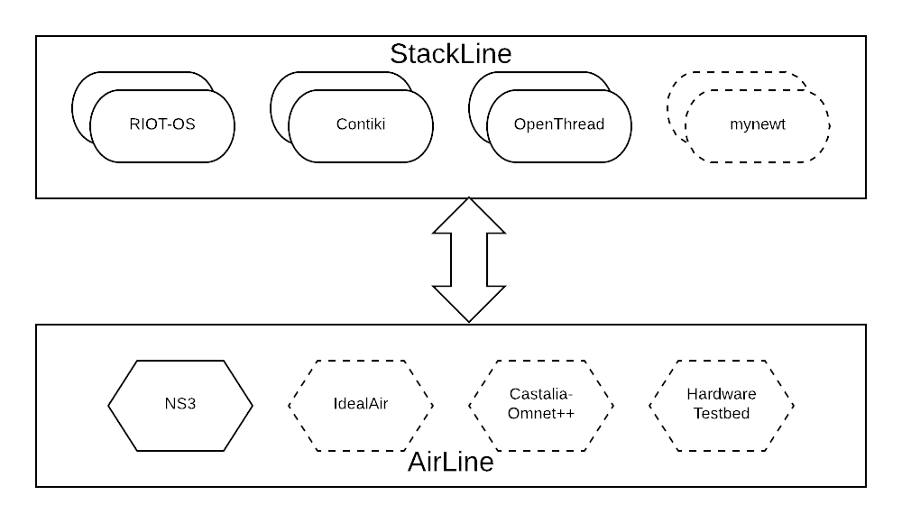
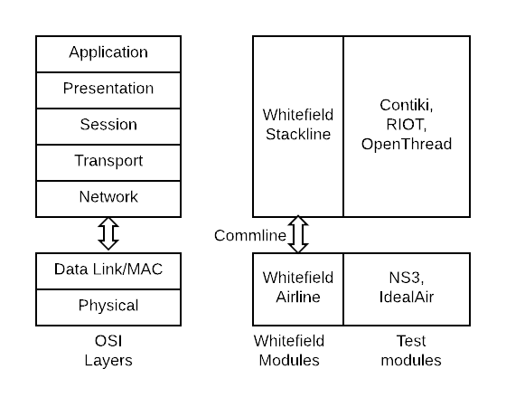
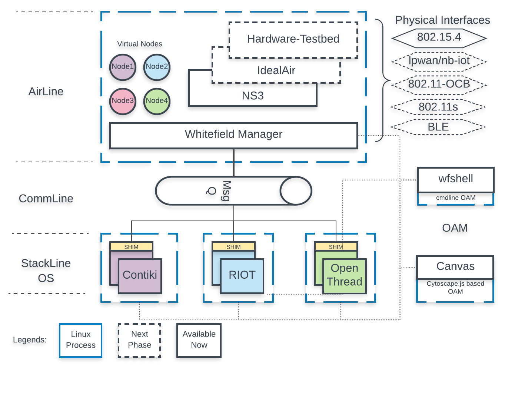

# Whitefield

Simulation Framework for Wireless Sensor Networks

---
### Yet another framework!

- But we already have
    - NS3/Omnet++
    - Cooja
    - Hardware Testbeds (FIT/IOT-Lab) (https://www.iot-lab.info/)

---
### Why Whitefield?

- Testing with realistic RF is important
    - Cooja cannot give you realistic RF
    - Cooja cannot scale to hundreds of nodes
- NS3/Omnet++ gives realistic RF
    - But cannot directly interface with real world stacks
- Protocol Design/performance/efficiency
    - Dependency on link layer tech
    - Asymmetric/Transient links

---
### Whitefield - a quick overview

- Plugs in real-world protocols stacks with realistic RF
- Real-world protocol stacks (Contiki/RIOT)
    - you can plugin your favourite OS/stack easily
- With realistic RF simulation (NS3)
- Scale (thousands of nodes without breaking a sweat)!
- Works for 802.15.4 today but can be extended for
    - BLE, 802.11-OCB, 802.11s

---
### Whitefield - High Level Design

@div[left-50]
  

@divend

@div[right-50]
  

@divend

---
### Whitefield - In more details

@div[center]
  

@divend

---
### Our Experience
- Lets talk practical IoT
- We implemented and tested,
    - IETF RFCs, and drafts
    - IEEE papers
- Unrealistic data with Cooja
- Few use NS3, Castalia-Omnet++
    - Requires more effort
    - Does not report data on real world protocol stacks

---
## experience(contd)
- Performance@scale
    - example, routing/adhoc issues @ scale
- Design@scale
    - example, neighbor mgmt issues
- Most of the plugfests, prototypes are limited to few nodes
- Rarely you see pratical prototypes with 100s/1000s of nodes

---
## Screenshots
1. configuration
2. start whitefield
3. monitor network
4. monitor network with canvas
5. OAM - wfshell
6. OAM - monitor routing table agnostic of the OS stack used
7. pcap
8. logging
